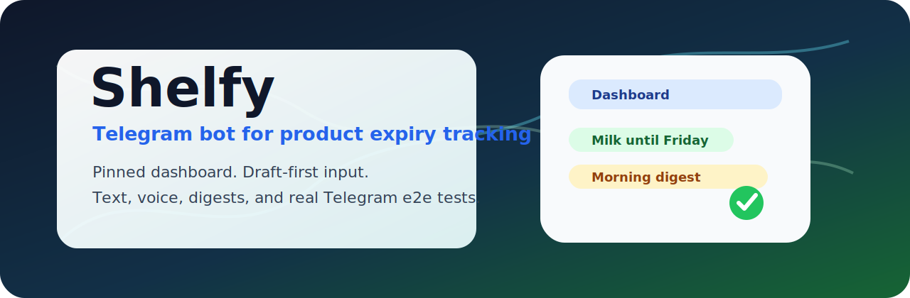

<p align="center">
  
</p>

<h1 align="center">Shelfy</h1>

<p align="center">
  Personal Telegram bot for tracking product expiration dates without turning a chat into a command log.
</p>

<p align="center">
  
  
  
  
</p>

<p align="center">
  <a href="#why-shelfy">Why Shelfy</a> ·
  <a href="#quick-start">Quick start</a> ·
  <a href="#architecture">Architecture</a> ·
  <a href="#testing">Testing</a> ·
  <a href="#repository-map">Repository map</a>
</p>

## Why Shelfy

Shelfy is built for a narrow household workflow: write down a product, keep its
expiration date visible, and get a morning reminder when something needs
attention.

The bot uses a pinned Telegram dashboard as the main control surface. New
products are added from ordinary text, voice messages, or audio files. Before a
record is saved, Shelfy shows a transient draft card so the user can confirm or
edit the parsed name and date.

| Capability | What it gives |
| --- | --- |
| Pinned dashboard | One stable home screen for lists, soon-expiring products, stats, and settings. |
| Draft-first input | Parsed data is confirmed before it becomes a product record. |
| Text and voice ingestion | The same product draft flow works for typed text, Telegram voice, and audio files. |
| Local speech path | `ffmpeg` and Vosk convert Russian speech to text inside the local runtime. |
| Bounded LLM role | Ollama can clean noisy input, but deterministic code still validates the final draft. |
| Real Telegram e2e tests | Product-owned scenarios are executed through a sibling Telegram test tool. |

## Quick Start

```bash
cp .env.example .env
make setup
make runtime-base
make dev
```

For the command list:

```bash
make help
```

The local runtime expects:

- a filled `.env` with Telegram and database settings;
- a host Ollama server reachable from Docker at
  `http://host.docker.internal:11434`;
- Vosk `small-ru-0.22` under `./models/vosk-model-small-ru-0.22`;
- the shared runtime image `shelfy-runtime-base:vosk-lib-0.3.45-small-ru-0.22`.

`make dev` starts the Docker Compose stack. Use
`make runtime-base-rebuild` only when ASR/runtime dependencies change.

## Architecture

Shelfy runs as a small set of Go processes over PostgreSQL:

| Process | Responsibility |
| --- | --- |
| `migrate` | Applies SQL migrations before long-running services start. |
| `telegram-api` | Receives Telegram updates, handles `/start`, dashboard callbacks, and enqueueing. |
| `pipeline-worker` | Processes text/audio ingestion jobs, creates draft sessions, and applies cleaner updates. |
| `scheduler-worker` | Sends morning digests, performs cleanup, and exposes non-production test controls. |
| `postgres` | Stores users, products, drafts, jobs, digest messages, ingest events, and virtual time. |

The application keeps time-based behavior testable through `app_clock` and
non-production control endpoints. Business logic still runs through the same
storage, scheduler, and Telegram paths used by the bot.

## Testing

Run package tests:

```bash
make test
```

Run formatting/lint check:

```bash
make lint
```

Regenerate typed SQL code after schema or query changes:

```bash
make generate
```

Shelfy keeps only product-owned Telegram e2e assets in this repository:

- [`e2e/telegram/scenarios`](./e2e/telegram/scenarios) contains interaction
  scenarios;
- [`e2e/telegram/date-cases.txt`](./e2e/telegram/date-cases.txt) contains a
  reusable product/date phrase matrix.

Execution, fixtures, transcripts, and generic orchestration live in the sibling
`telegram-bot-e2e-test-tool` repository.

Typical run:

```bash
make -C ../telegram-bot-e2e-test-tool run-scenario \
  CHAT=@your_bot_username \
  SCENARIO="$PWD/e2e/telegram/scenarios/00-home-ready.jsonl $PWD/e2e/telegram/scenarios/03-text-fast-path-complete.jsonl"
```

Date matrix run:

```bash
make -C ../telegram-bot-e2e-test-tool run-text-matrix \
  CHAT=@your_bot_username \
  CASES="$PWD/e2e/telegram/date-cases.txt"
```

Useful local triage:

```bash
make e2e-last-failure
make e2e-trace-logs TRACE_ID=74ca98dc944f13f4
make e2e-trace-logs SCENARIO_LABEL=02-dashboard-navigation-and-settings
```

## Ingest Benchmark

Shelfy includes a product-specific text and voice ingestion benchmark:

```bash
make benchmark-ingest-smoke ARGS='-include voice -dataset-setup'
make benchmark-ingest-prod ARGS='-dataset-setup -emit-report'
```

The benchmark corpus lives next to the package under
`internal/ingest/testdata/`. That location follows the Go `testdata`
convention and keeps parser fixtures close to the code that owns them.

## Repository Map

| Path | Purpose |
| --- | --- |
| `cmd/telegram-api` | Main Telegram bot process. |
| `cmd/pipeline-worker` | Background text/audio ingestion process. |
| `cmd/scheduler-worker` | Digest and cleanup scheduler. |
| `cmd/migrate` | Database migration entrypoint. |
| `cmd/vosk-transcribe` | Small platform-specific ASR helper binary. |
| `cmd/ingest-benchmark` | Benchmark CLI split into runtime, evaluation, and report files. |
| `cmd/e2e-triage` | Compact local triage helpers for failed e2e runs. |
| `internal/bot` | Telegram UX flow, callbacks, dashboard, and drafts. |
| `internal/ingest` | Text/audio parsing, cleaner pipeline, ASR integration, and benchmark fixtures. |
| `internal/scheduler` | Timed digests, cleanup, and non-production control API. |
| `internal/storage/postgres` | Queries, generated `sqlc` code, and persistence adapters. |
| `assets/copy` | Runtime Russian copy catalog. |
| `assets/asr` | ASR grammar assets. |
| `assets/brand` | GitHub/README visual assets. |
| `e2e/telegram` | Product-owned e2e scenarios and input matrices. |
| `docs/internal` | Maintainer notes for copy work, benchmarks, cleaner tuning, and backlog. |

## Notes For Maintainers

- Runtime user-facing copy lives in
  [`assets/copy/runtime.ru.yaml`](./assets/copy/runtime.ru.yaml).
- Copy metadata lives in
  [`docs/internal/message-inventory.ru.yaml`](./docs/internal/message-inventory.ru.yaml);
  it is not a second runtime catalog.
- Local artifacts are written under `tmp/` and are intentionally ignored.
